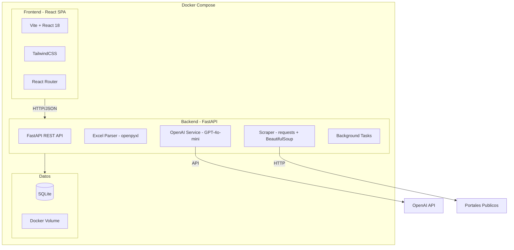
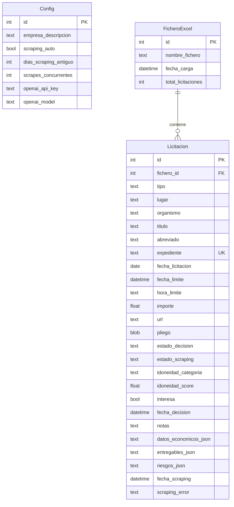

# App Licitaciones - Plan de Implementacion MVP

## Arquitectura General



## Stack Tecnologico

- **Frontend:** React 18 + Vite + TypeScript + TailwindCSS + React Router + Axios
- **Backend:** Python 3.11 + FastAPI + SQLAlchemy + Pydantic + openpyxl
- **Base de datos:** SQLite (volumen Docker persistente)
- **IA:** Google Gemini API (gemini-1.5-flash para idoneidad/resumenes, gemini-1.5-pro para extraccion de pliegos)
- **Scraping:** requests + BeautifulSoup4 + PyPDF2/pdfplumber para PDFs
- **Despliegue:** Docker Compose (frontend Nginx + backend Uvicorn)

## Modelo de Datos (SQLite)



## Estructura de Ficheros

```
04.Licitaciones/
  backend/
    app/
      __init__.py
      main.py              # FastAPI app, CORS, lifespan
      database.py           # SQLAlchemy engine + session
      models.py             # ORM models (Licitacion, Config, FicheroExcel)
      schemas.py            # Pydantic schemas
      routers/
        licitaciones.py     # CRUD + filtros + KPIs
        excel_import.py     # CU-01, CU-10
        scraping.py         # CU-02, CU-06, CU-07
        config.py           # CU-04
        backup.py           # CU-09
      services/
        excel_parser.py     # Parseo openpyxl segun mapeoexcel.md
        ai_service.py       # OpenAI: idoneidad, resumen, extraccion
        scraper_service.py  # HTTP + PDF download + parse
    requirements.txt
    Dockerfile
  frontend/
    src/
      main.tsx
      App.tsx
      api/
        client.ts           # Axios instance
        licitaciones.ts     # API calls
        config.ts
      pages/
        HomePage.tsx         # Lista + KPIs + filtros (CU-01, CU-05, CU-08)
        DetailPage.tsx       # Detalle licitacion (CU-02, CU-03, CU-07)
        ImportPage.tsx       # Importar Excel (CU-01)
        UpdatePage.tsx       # Actualizar Excel (CU-10)
        ConfigPage.tsx       # Configuracion + Backup (CU-04, CU-09)
      components/
        KpiCards.tsx         # Tarjetas KPI superiores
        LicitacionTable.tsx  # Tabla con paginacion
        FilterPanel.tsx      # Filtros laterales/superiores
        StatusBadge.tsx      # Badges de estado
        Layout.tsx           # Layout general con navbar
      types/
        index.ts
    package.json
    tailwind.config.ts
    vite.config.ts
    Dockerfile
    nginx.conf
  docker-compose.yml
  .env.example
  Docs/                      # Documentacion existente (no tocar)
```

## Estilo Visual (basado en LookAndFeel.md e imagen de referencia)

Se aplicara el estilo dashboard limpio de la imagen de referencia:

- **Fuente:** Inter (Google Fonts)
- **Fondo general:** `#F5F5F7`, tarjetas blancas `#FFFFFF`
- **Texto principal:** `#111827`, secundario `#4B5563`
- **Boton primario:** `#2563EB` (azul), hover `#1D4ED8`
- **Estados:** verde `#16A34A` (positivo), rojo `#DC2626` (error), amarillo `#FACC15` (alerta)
- **Bordes redondeados:** 12-16px cards, pill buttons
- **Sombras suaves:** `0 10px 25px rgba(15, 23, 42, 0.05)`
- **KPI cards** en banda superior con numeros grandes (24-32px bold)
- **Tabla** con filas alternadas, paginacion, checkboxes de seleccion

## Fases de Implementacion

### Fase 1: Infraestructura y Base de Datos
- Crear estructura de proyecto (backend + frontend)
- Configurar Docker Compose con 2 servicios + volumen SQLite
- Definir modelos SQLAlchemy y crear tablas
- Implementar endpoint de health check

### Fase 2: Backend - Importacion Excel y API Core
- Parser de Excel segun `mapeoexcel.md` (campos: TIPO, AMBITO GEOGRAFICO, ORGANISMO, TITULO, N EXPEDIENTE, FECHA LICITACION, FECHA LIMITE OFERTAS, HORA LIMITE OFERTAS, IMPORTE, PCAT)
- CRUD de licitaciones con filtros (idoneidad, estado, lugar, importe)
- Endpoint de KPIs (importe max, licitacion mayor, conteo filtrado)
- Endpoint de listado paginado con ordenacion

### Fase 3: Backend - Servicio de IA (OpenAI)
- Calculo de idoneidad: prompt con perfil empresa + descripcion licitacion -> score 0-100 -> categoria (muy alta/alta/baja/muy baja)
- Generacion de "Abreviado" (resumen semantico del titulo)
- Extraccion de datos de pliegos: obligaciones, entregables, importes detallados, lotes, garantias, riesgos
- Recalculo de idoneidad post-scraping

### Fase 4: Backend - Scraping y Extraccion
- Descarga de documento desde URL (HTML/PDF)
- Almacenamiento del pliego en BBDD
- Llamada a AI service para interpretar el documento
- Scraping en lote con cola de tareas (BackgroundTasks de FastAPI)
- Gestion de estados de scraping y reintentos (max 3)
- Deteccion de scraping antiguo (fecha_scraping + N dias)

### Fase 5: Backend - Configuracion, Backup y Actualizacion
- CRUD de configuracion (perfil empresa, parametros scraping, OpenAI key)
- Backup: generar descarga del fichero SQLite comprimido
- Restore: subir fichero backup y reemplazar la BBDD
- Actualizacion desde nuevo Excel (match por expediente, merge sin perder notas/decisiones)
- Exportacion a Excel de licitaciones seleccionadas

### Fase 6: Frontend - Layout, Home y Componentes Base
- Configurar TailwindCSS con la paleta del LookAndFeel
- Layout general con navbar (busqueda, acciones, config)
- KPI Cards (importe max, licitacion mayor, conteo)
- Tabla de licitaciones con paginacion, seleccion, ordenacion
- Panel de filtros (idoneidad, estado decision, estado scraping, lugar)
- Badges de estado con colores semanticos

### Fase 7: Frontend - Detalle, Importacion y Configuracion
- Pagina de detalle: layout 2 columnas (datos negocio + scraping/analisis)
- Toggle "Me interesa", notas personales, dropdown idoneidad
- Boton "Scrapear ahora" con feedback de progreso
- Visualizacion de entregables (scroll box), riesgos, datos economicos
- URL editable con validacion
- Pagina de importacion/actualizacion Excel con drag-and-drop
- Pagina de configuracion con secciones (Perfil IA, Scraping, Mantenimiento)
- Backup/Restore integrado en configuracion

### Fase 8: Integracion y Docker
- Dockerfiles optimizados (multi-stage builds)
- docker-compose.yml con servicios frontend (Nginx), backend (Uvicorn), volumen datos
- Variables de entorno (.env) para OpenAI API key
- Pruebas de flujo completo end-to-end

---

## Tareas

| ID | Fase | Descripcion | Estado |
|---|---|---|---|
| phase1-infra | 1 | Crear estructura proyecto, Docker Compose, modelos SQLAlchemy, tablas SQLite | Pendiente |
| phase2-api-excel | 2 | Backend - Parser Excel (openpyxl), CRUD licitaciones, filtros, KPIs, paginacion | Pendiente |
| phase3-ai | 3 | Backend - Servicio OpenAI (idoneidad, resumenes, extraccion datos pliegos) | Pendiente |
| phase4-scraping | 4 | Backend - Scraping URLs/PDFs, cola de tareas, reintentos, estados scraping | Pendiente |
| phase5-config-backup | 5 | Backend - Configuracion, backup/restore, actualizacion Excel, exportacion | Pendiente |
| phase6-frontend-home | 6 | Frontend - TailwindCSS, Layout, KPI Cards, Tabla licitaciones, Filtros | Pendiente |
| phase7-frontend-detail | 7 | Frontend - Detalle, importacion Excel, configuracion, backup/restore | Pendiente |
| phase8-docker | 8 | Dockerfiles, docker-compose, .env, pruebas integracion end-to-end | Pendiente |
